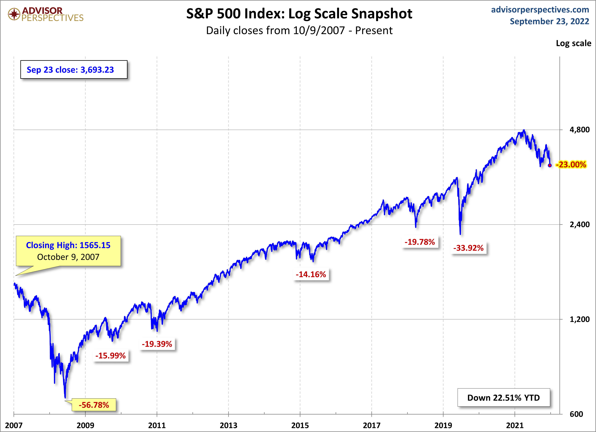
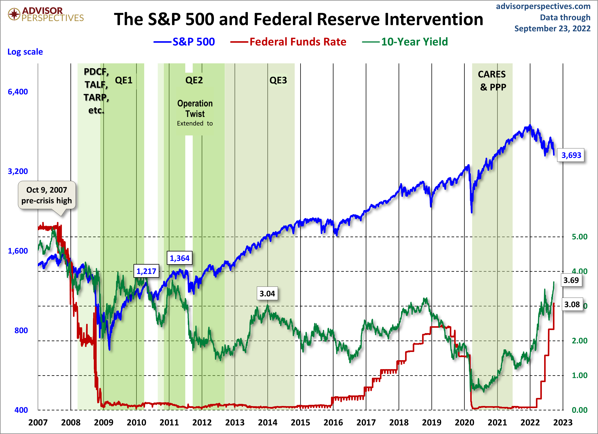

Geldanlage-Möglichkeiten
========================

Schnelleinstieg
---------------

Wenn man sich nicht viel mit Geldanlage beschäftigen will, sollte man mit den folgenden
Informationen eine solide Grundlage schaffen bzw bei noch mehr Wissen immer wieder zu prüfen,
ob die einfachen Regeln nicht viel besser sind:

- Spare mindestens 10 % des verfügbaren Einkommens von jungen Jahren an für die Rente.
- Investiere nur Geld, das Du mindestens die nächsten 10 Jahre nicht anderweitig benötigst.
- Leg eine Geldreserve für Probleme wie Arbeitslosigkeit oder "Auto muß neu gekauft werden" zurück.
- Schaue nach günstigen Konditionen sowohl beim Broker wie bei den gekauften Finanzprodukten.
- Als Finanzprodukt ist ein ETF für den weltweiten Aktienmarkt zu empfehlen, wie z.B. der
  [Vanguard FTSE All-World, WKN:A1JX52, ISIN:IE00B3RBWM25](https://www.justetf.com/de/etf-profile.html?isin=IE00B3RBWM25).
   - Als Alternative kommt ein ETF auf den [MSCI World](https://www.justetf.com/de/how-to/msci-world-etfs.html) wie z.B.
     der [SPDR MSCI World UCITS ETF](https://www.justetf.com/de/etf-profile.html?isin=IE00BFY0GT14) oder der
     [iShares MSCI ACWI UCITS ETF](https://www.justetf.com/de/etf-profile.html?isin=IE00B6R52259) in Frage.
- Als günstigen Broker in Deutschland würde ich [Scalable Capital](https://de.scalable.capital/) empfehlen.
- Am besten einen festen monatlichen Sparplan zum Kauf des ETFs anlegen. Auch Einmalkäufe sind jederzeit möglich.

Noch mehr Informationen
-----------------------

- [Gerd Kommer: Passiv investieren – die Basics](https://gerd-kommer.de/passiv-investieren-die-basics/)
- [DAX Rendite-Dreiecke vom Deutschen Aktieninstitut](https://www.dai.de/rendite-dreiecke/)
   - [MSCI-World Renditedreieck von Christian W. Röhl](https://www.dividendenadel.de/msci-world-renditedreieck/)
- [DAX Renditedreieck von Finanzfluss](https://www.finanzfluss.de/geldanlage/dax-rendite-dreieck/)
- [Finanzfluss: Geldanlage](https://www.finanzfluss.de/geldanlage/)
   - [Finanzfluss: ETF-Handbuch](https://www.finanzfluss.de/etf-handbuch/)
      - [YouTube: Finanzfluss: Alles über ETFs in nur 15 Minuten: Index, Sparplan, Steuern](https://www.youtube.com/watch?v=r80NOOdFIn8)
   - [Finanzfluss: ETF-Suche](https://www.finanzfluss.de/informer/etf/suche/)
      - [YouTube: Finanzfluss: ETF Suche in der Praxis](https://www.youtube.com/watch?v=jD6QlUAPzMg)
- [Stiftung Warentest Finanztest](https://www.test.de/abo/finanztest/)
   - [Stiftung Warentest Spezialhefte](https://www.test.de/shop/geldanlage-banken/?sort0=Bestseller)
- [Wikipedia: Zinseszins](https://de.wikipedia.org/wiki/Zinseszins)
   - [Finanzfluss: Zinseszinsrechner](https://www.finanzfluss.de/rechner/zinseszinsrechner/)
   - [Finanzfluss: Kann man als „normaler“ Angestellter wirklich Millionär werden?](https://www.youtube.com/watch?v=r_kT1NlVamY)
   - 72er Regel zur Verdopplung des Vermögens
      - [Finanzfluss: 72er-Regel](https://www.finanzfluss.de/geldanlage/72er-regel/)
      - [Wikipedia: 72er-Regel](https://de.wikipedia.org/wiki/72er-Regel)
      - [Youtube: Finanztip: Die wahre Natur des Zinseszinses](https://www.youtube.com/watch?v=ZMlQN7ZPY8s)
      - Bei 10 % jährlichem Gewinn: Mit Zahlung der (jährlichen) Kapitalertragsteuern von 26,375 % auf den Gewinn und
        jährlicher Inflation von 3,325 % auf das Kapital:
         - ohne Steuern und ohne Inflation: (Preis-)Verdopplung nach 7 Jahren
         - nach Steuern und ohne Inflation: Verdopplung in unter 10 Jahren
         - nach Steuern und nach/mit Inflation (4 % reale Rendite): (Kaufkraft-)Verdopplung nach 18 Jahren
      - Bei 15 % Jahresgewinn entsteht eine reale Rendite von 7,7 % und eine (Kaufkraft-)Verdopplung in unter 10 Jahren.
      - Bei 5 % Jahresgewinn entsteht eine reale Rendite von 0,35 % und damit ein Kapitalerhalt
        bzw. (Kaufkraft-)Verdopplung in 200 Jahren (???).
      - Geld unverzinst auf dem Konto mit 3,325 % Inflation: Halbierung der Kaufkraft nach 22 Jahren.
   - Langfristige Charts sollten immer mit [Logarithmischer Dartellung](https://de.wikipedia.org/wiki/Logarithmische_Darstellung)
     eingestellt sein. Der Preis wird in y-Richtung aufgetragen und bei gleichen Abschnitten in y-Richtung ist immer eine Verdopplung im
     Preis zu sehen (Wenn es eine Verdopplung von 100 auf 200 gibt, dann ist im gleichen Abstand eine weitere Verdopplung auf 400 zu sehen.)
- Prozentrechnen
   - Wenn der Aktienpreis 50 % einbricht, dann muss er erst wieder 100 % steigen, um den usprünglichen Kurs wieder zu erreichen.
   - Bei einem 66 % Einbruch muss der Aktienpreis erst wieder 300 % auf den ursprünglichen Aktienkurs steigen.
- 4-Prozent-Regel für eine Entnahme im Rentenalter (4 % Rule and Safe Withdrawal Rates (SWR))
   - Ganz vereinfachte Darstellung: Wenn man langfristig eine Rendite von 7 % mit der Aktienanlage hat und mit einer
     durchschnittlichen Inflationsrate von 3 % rechnet, dann kann man 4 % des Aktienvermögens jedes Jahr als Rente auszahlen.
     Das Aktienvermögen und auch die zukünftigen Auszahlungen steigen beide um die Inflation mit an. Die Auszahlung muss
     dann natürlich noch versteuert werden. Oft wird nur von 3,5 % an Auszahlungen ausgegangen, damit man auch bei einem
     schlechten Verlauf vom Aktienmarkt noch sicher ist und das Aktiendepot nicht "aufbraucht".
   - <https://www.finanzfluss.de/rechner/finanzielle-freiheit/>
   - <https://geldhelden.org/die-4-entnahme-regel-dein-weg-in-die-finanzielle-freiheit/>
   - <https://frugalisten.de/die-4-prozent-regel-wie-viel-geld-brauchst-du-um-nicht-mehr-arbeiten-gehen-zu-muessen/>
   - <https://www.ranioli.ch/unsere-cape-basierte-entnahme-regel/>
   - <https://earlyretirementnow.com/safe-withdrawal-rate-series/>
   - <https://portfoliocharts.com/charts/withdrawal-rates/> Perpetual Withdrawal Rate (PWR)
- Auswahl von ETFs/Fonds:
   - <https://www.justetf.com/>
      - [YouTube justETF](https://www.youtube.com/c/justETF/videos)
      - [YouTube ETF-Weltportfolio zum Selbstbauen von Jan Altmann](https://www.youtube.com/watch?v=I6CHV_duWkc)
   - <https://etfdb.com/>
   - <https://de.extraetf.com/>
   - <https://www.trackingdifferences.com/>
      - <https://blog.trackingdifferences.com/meine-anlagestrategie-im-jahr-2021/>
   - <https://www.fondsweb.com/>
   - <https://www.etf.com>
- [Dr. Armin Pszola: Reicht ein Welt-ETF?](https://www.youtube.com/watch?v=PC9TC9to7kc)
- [Finanzfluss: Wenn ich nur EINEN ETF für immer halten müsste – welcher wäre es?](https://www.youtube.com/watch?v=_pYG2XxtHFY)
- [Christian Delacour: Mit einem ETF zur Welt AG, 5 TOP solo Aktien-ETFs](https://www.youtube.com/watch?v=wBIlfl8R4AI)
- [Christian Delacour: Die besten ETFs 2023. Aktien-ETF Auswahl & Aufteilung, Welt-AG](https://www.youtube.com/watch?v=yPyLi6vtA08)
- [Pfennigfabrik: 7 prominente Welt-ETF-Strategien im Vergleich](https://www.youtube.com/watch?v=2tsUdgjgtdo)
- [YouTube Rob Berger: How to Create a 3 Fund Portfolio, A Beginner's Guide](https://www.youtube.com/watch?v=kmw8OpGp2rM)
- [Vanguard](https://investor.vanguard.com/)
   - <https://www.bogleheads.org/>
   - [YouTube Bogleheads](https://www.youtube.com/@bogleheads3687/videos)

Die Geldanlage in Aktien sollte gut diversifiziert sein in ein liquides Produkt. Die Fondsgröße
bietet auch einen Hinweis auf beliebte Produkte.

Wenn man ganz neu startet oder wenn man die Anlage einfach, solide, (Kosten-)günstig
und zeitsparend sein soll, dann ist ein Sparplan auf den FTSE All-World sehr gut.
Nur ein Produkt für die komplette Aktienanlage.
(Mit höherem US-Anteil ist auch der MSCI World sehr beliebt.)

Sehr gute Visualisierung [Weltweiter Aktienmärkte](https://finviz.com/map.ashx?t=geo&st=w52) bzw
[SP500 Jahresperformance](https://finviz.com/map.ashx?t=sec&st=w52).
Dazu noch [Wikipedia: Liste der Wertpapierbörsen nach Marktkapitalisierung](https://de.wikipedia.org/wiki/Liste_der_Wertpapierb%C3%B6rsen_nach_Marktkapitalisierung)
und [Wikipedia: Liste der Länder nach Bruttoinlandsprodukt (BIP)](https://de.wikipedia.org/wiki/Liste_der_L%C3%A4nder_nach_Bruttoinlandsprodukt).
(Eventuell auch [Wikipedia: Liste der Länder nach BIP pro Kopf](https://de.wikipedia.org/wiki/Liste_der_L%C3%A4nder_nach_Bruttoinlandsprodukt_pro_Kopf).)

Die USA haben den größten und stärksten Aktiemarkt.
Speziell Technologie-Firmen sind in der Vergangenheit sehr stark gewesen.
Zu den US-Aktien eine Übersicht von 2007 bis 2022 und einen Vergleich von Zentralbankzinsen und dem Aktienmarkt:

Aktien sind [Eigenkapital](https://de.wikipedia.org/wiki/Eigenkapital) der Firmen, Anleihen sind
[Fremdkapital](https://de.wikipedia.org/wiki/Fremdkapital).
Im Unterschied zu Aktien werden Inhaber von Anleihen nicht am Unternehmen beteiligt, bekommen aber für
eine vorher festgelegte Laufzeit Zinsen ausbezahlt.
Der Anleihenmarkt ist größer als der Aktienmarkt.

FTSE All-World
--------------

4.130 Unternehmen.
Bei der Ländergewichtung ist man zu 59 % in die USA investiert, 10 % in Schwellenländer.
Die 10 größten Firmen haben einen Anteil von 14,92 %.

Eines der folgenden beiden Produkte auswählen (sind bis auf die Ausschüttung das gleiche Produkt):

- [Finanzfluss: FTSE-All-World ETFs](https://www.finanzfluss.de/informer/etf/suche/?base_index=FTSE%20All-World)
- Nur in eine Auswahl aller Aktien (ca. 3720) wird tatsächlich investiert.
- Vanguard FTSE All-World, WKN:A1JX52, ISIN:IE00B3RBWM25, Symbol: VWRD (VGWL?)
   - Ausschüttend, Replikationsart: physisch optimiert, TER 0,22 %, [TD -0,02 %](https://www.trackingdifferences.com/ETF/ISIN/IE00B3RBWM25)
   - Fondsgröße 12.462 Millionen (2022-05), Fondswährung USD
   - Auflagedatum 2012-05-22
   - [finanzen.net: FTSE-All-World ausschüttend](https://www.finanzen.net/etf/vanguard-ftse-all-world-etf-ie00b3rbwm25)
   - <https://www.de.vanguard/professionell/anlageprodukte/etf/aktien/9505/ftse-all-world-ucits-etf-usd-distributing>
- Vanguard FTSE All-World, WKN:A2PKXG, ISIN:IE00BK5BQT80, Symbol:VWCE
   - Thesaurierend, Replikationsart: physisch optimiert, TER 0,22 %, [TD 0,05 %](https://www.trackingdifferences.com/ETF/ISIN/IE00BK5BQT80)
   - Fondsgröße 12.462 Millionen (2022-05), Fondswährung USD
   - Auflagedatum 2019-07-23
   - [finanzen.net: FTSE-All-World thesaurierend](https://www.finanzen.net/etf/vanguard-ftse-all-world-etf-ie00bk5bqt80)
   - <https://www.de.vanguard/professionell/anlageprodukte/etf/aktien/9679/ftse-all-world-ucits-etf-usd-accumulating>
- Invesco FTSE All-World UCITS ETF Dist, WKN:A3D7QY, ISIN:IE0000QLH0G6
   - Ausschüttend, Replikationsart: physisch optimiert, TER 0,15 %, [TD x %](https://www.trackingdifferences.com/ETF/ISIN/IE0000QLH0G6)
   - Fondsgröße 4 Millionen (2023-07), Fondswährung USD
   - Auflagedatum 2023-06-26
   - [finanzen.net: Invesco FTSE-All-World ausschüttend](https://www.finanzen.net/etf/vanguard-ftse-all-world-etf-ie0000qlh0g6)
- Invesco FTSE All-World UCITS ETF Acc, WKN:A3D7QX, ISIN:IE000716YHJ7
   - Thesaurierend, Replikationsart: physisch optimiert, TER 0,15 %, [TD x %](https://www.trackingdifferences.com/ETF/ISIN/IE000716YHJ7)
   - Fondsgröße 4 Millionen (2023-07), Fondswährung USD
   - Auflagedatum 2023-06-26
   - [finanzen.net: Invesco FTSE-All-World ausschüttend](https://www.finanzen.net/etf/vanguard-ftse-all-world-etf-ie000716yhj7)

MSCI
----

<https://www.justetf.com/de/news/etf/die-msci-index-klassifikationen-und-wie-sie-die-welt-einteilen.html>

<https://www.justetf.com/de/how-to/msci-acwi-etfs.html>

MSCI All-Country World-Index IMI (ACWI IMI)
-------------------------------------------

Ca. 9.270 Aktien aus 47 Ländern.
Bei der Ländergewichtung ist man zu 59 % in die USA investiert.
Die 10 größten Firmen haben einen Anteil von 13,80 %.

- [Finanzfluss: MSCI-All-Country-World-Investable-Market (ACWI IMI) ETFs](https://www.finanzfluss.de/informer/etf/suche/?base_index=MSCI%20All%20Country%20World%20Investable%20Market%20%28ACWI%20IMI%29)
- SPDR MSCI ACWI IMI UCITS ETF, WKN:A1JJTD, ISIN:IE00B3YLTY66
   - Thesaurierend, Replikationsart: physisch optimiert, TER 0,40 %, [TD -0,05 %](https://www.trackingdifferences.com/ETF/ISIN/IE00B3YLTY66)
      - TER 0,17 % (ist neuerdings gesenkt worden)
   - Fondsgröße 458 Millionen (2022-08), Fondswährung USD
   - Auflagedatum 2011-05-13
   - [finanzen.net: MSCI ACWI IMI](https://www.finanzen.net/etf/spdr-msci-acwi-imi-etf-ie00b3ylty66)
   - Nur in eine Auswahl aller Aktien (ca. 1800) wird tatsächlich investiert.

MSCI All-Country World-Index (ACWI)
-----------------------------------

2.937 Unternehmen weltweit.
Bei der Ländergewichtung ist man zu 59 % in die USA investiert.
Die 10 größten Firmen haben einen Anteil von 17,19 %.

- [Finanzfluss: MSCI-ACWI ETFs](https://www.finanzfluss.de/informer/etf/suche/?base_index=MSCI%20ACWI)
- iShares MSCI ACWI UCITS ETF, WKN:A1JMDF, ISIN:IE00B6R52259
   - Thesaurierend, Replikationsart: physisch optimiert, TER 0,20 %, [TD 0,24%](https://www.trackingdifferences.com/ETF/ISIN/IE00B6R52259)
   - Fondsgröße 4.996 Millionen (2022-06), Fondswährung USD
   - Auflagedatum 2011-10-21
   - [finanzen.net: MSCI ACWI](https://www.finanzen.net/etf/ishares-msci-acwi-etf-ie00b6r52259)
   - Nur in eine Auswahl aller Aktien (ca. 1645) wird tatsächlich investiert.

MSCI World
----------

[YouTube: Finanzfluss: MSCI World ETF im Vergleich](https://www.youtube.com/watch?v=ElkELpWP69c)

Gewichtung erfolgt nach der Marktkapitalisierung.
1.539 Unternehmen.
Bei der Ländergewichtung ist man zu 67 % in die USA investiert. Nur Industrieländer, keine Schwellenländer.
Die 10 größten Firmen sind Apple, Microsoft, Amazon, Tesla, Alphabet A und C, Nvidia, Meta Platforms, JP Morgan und Home Depot.
Die 10 größten Firmen haben einen Anteil von 19,81 %.

- [Finanzfluss MSCI-World ETFs](https://www.finanzfluss.de/informer/etf/suche/?base_index=MSCI%20World)
- iShares Core MSCI World, WKN:A0RPWH, ISIN:IE00B4L5Y983
   - Thesaurierend, Replikationsart: physisch optimiert, TER 0,20 %, [TD 0,08 %](https://www.trackingdifferences.com/ETF/ISIN/IE00B4L5Y983)
   - Fondsgröße 41.603 Millionen (2022-06), Fondswährung USD
   - Auflagedatum 2009-09-25
   - [finanzen.net: iShares Core MSCI World](https://www.finanzen.net/etf/ishares-core-msci-world-etf-ie00b4l5y983)
- Lyxor Core MSCI World (DR) UCITS ETF, WKN:LYX0YD, ISIN:LU1781541179
   - Thesaurierend, Replikationsart: physisch optimiert, TER 0,12 %, [TD 0,03 %](https://www.trackingdifferences.com/ETF/ISIN/LU1781541179)
   - Fondsgröße 1.814 Millionen (2022-06), Fondswährung USD
   - Auflagedatum 2018-02-28
   - [finanzen.net: Lyxor Core MSCI World (DR)](https://www.finanzen.net/etf/lyxor-core-msci-world-dr-etf-lu1781541179)
- Lyxor MSCI World (LUX) UCITS ETF, WKN:ETF110, ISIN:LU0392494562
   - Ausschüttend, Replikationsart: synthetisch, TER 0,20 %, [TD 0,01 %](https://www.trackingdifferences.com/ETF/ISIN/LU0392494562)
   - Fondsgröße 3.172 Millionen (2022-06), Fondswährung USD
   - Auflagedatum 2008-11-27
   - [finanzen.net: Lyxor MSCI World (LUX)](https://www.finanzen.net/etf/lyxor-msci-world-lux-etf-lu0392494562)
- SPDR MSCI World, WKN:A2N6CW, ISIN:IE00BFY0GT14, [TD -0,05 %](https://www.trackingdifferences.com/ETF/ISIN/IE00BFY0GT14)
- Xtrackers MSCI World, WKN:DBX1MW, ISIN:LU0274208692 [TD 0,10 %](https://www.trackingdifferences.com/ETF/ISIN/LU0274208692)
- Vanguard FTSE Developed World, WKN:A12CX1, ISIN:IE00BKX55T58, Symbol:VEA, [TD -0,09 %](https://www.trackingdifferences.com/ETF/ISIN/IE00BKX55T58)

Welt AG mit 3 ETFs
------------------

Schwellenländer und Small Caps hinzufügen: <https://www.youtube.com/watch?v=ldRGmU2jgCE>

- 70 % in Vanguard FTSE Developed World, WKN:A12CX1, ISIN:IE00BKX55T58, [TD -0,09 %](https://www.trackingdifferences.com/ETF/ISIN/IE00BKX55T58)
- 20 % in iShares Core MSCI EM IMI, WKN:A2JDYF, ISIN:IE00BD45KH83, [TD 0,07 %](https://www.trackingdifferences.com/ETF/ISIN/IE00BD45KH83)
- 10 % in iShares MSCI World Small Cap, WKN:A2DWBY, ISIN:IE00BF4RFH31, [TD 0,23 %](https://www.trackingdifferences.com/ETF/ISIN/IE00BF4RFH31)

S&P500 und Technologiewerte Nasdaq100
-------------------------------------

S&P500 sind die 500 größten Unternehmen in den USA, der Nasdaq100 sind die 100 größten Technologieunternehmen
in den USA. Beide sind in der Vergangenheit sehr gut gelaufen, bleiben aber natürlich eine Wette auf die USA.

Die 10 größten Firmen haben im S&P500 einen Anteil von 27,97 %.

Im Nasdaq100 haben die 6 größten Firmen (Apple, Microsoft, Amazon, Tesla, Alphabet C und A) einen
Anteil von 42,5 %. Apple hat einen Anteil von 13 %.

- [Finanzfluss SP500 ETFs](https://www.finanzfluss.de/informer/etf/suche/?base_index=S%26P%20500)
- Vanguard S&P 500, WKN:A1JX53, ISIN:IE00B3XXRP09, Symbol:VUSD
   - Ausschüttend, Replikationsart: physisch vollständig, TER 0,07 %, [TD -0,27 %](https://www.trackingdifferences.com/ETF/ISIN/IE00B3XXRP09)
   - Fondsgröße 32.632 Millionen (2022-05), Fondswährung USD
   - Auflagedatum 2012-05-22
   - <https://www.finanzen.net/etf/vanguard-sp-500-etf-ie00b3xxrp09>
- iShares Core S&P 500, WKN:622391, ISIN:IE0031442068
   - Ausschüttend, Replikationsart: physisch optimiert, TER 0,07 %, [TD -0,05 %](https://www.trackingdifferences.com/ETF/ISIN/IE0031442068)
   - Fondsgröße 12.788 Millionen (2022-05), Fondswährung USD
   - Auflagedatum 2002-03-15
   - <https://www.finanzen.net/etf/ishares-core-sp-500-etf-ie0031442068>
- iShares Core S&P 500, WKN:A0YEDG, ISIN:IE00B5BMR087, Symbol:CSSPX
   - Thesaurierend, Replikationsart: physisch vollständig, TER 0,07 %, [TD -0,21 %](https://www.trackingdifferences.com/ETF/ISIN/IE00B5BMR087)
   - Fondsgröße 53.994 Millionen (2022-05), Fondswährung USD
   - Auflagedatum 2010-05-19
   - <https://www.finanzen.net/etf/ishares-core-sp-500-etf-ie00b5bmr087>
- Invesco S&P 500 UCITS ETF, WKN:A1CYW7, ISIN:IE00B3YCGJ38
   - Thesaurierend, Replikationsart: Synthetisch, TER 0,05 %, [TD -0,26 %](https://www.trackingdifferences.com/ETF/ISIN/IE00B3YCGJ38)
   - Fondsgröße 15.233 Millionen (2022-05), Fondswährung USD
   - Auflagedatum 2010-05-20
   - <https://www.finanzen.net/etf/invesco-sp-500-etf-ie00b3ycgj38>

- [Finanzfluss Nasdaq-100 ETFs](https://www.finanzfluss.de/informer/etf/suche/?base_index=Nasdaq%20100)

Europa
------

STOXX Europe 600 Index: 600 Aktien zusammengesetzt aus Large-, Mid- und Small Caps 18 europäischer Länder.

- Länder: 25 % United Kingdom, 17 % Frankreich, 16 % Schweiz, 11 % Deutschland, 7 % Niederlande, 5 % Schweden, ...
- Aktien: Nestle, Roche, Shell, AstraZeneca, Novo Nordisk, Novartis, ASML, LVMH, Linde, TotalEnergies, ...

- Lyxor Core STOXX Europe 600 (DR) - ETF, WKN:LYX0Q0, ISIN:LU0908500753
   - Thesaurierend, Replikationsart: physisch vollständig, TER 0,07 %, [TD -0,17 %](https://www.trackingdifferences.com/ETF/ISIN/LU0908500753)
   - Fondsgröße 4.616 Millionen (2022-11), Fondswährung EUR
   - Auflagedatum 2013-04-03
   - <https://www.finanzen.net/etf/lyxor-core-stoxx-europe-600-dr-etf-lu0908500753>
- iShares STOXX Europe 600 ETF, WKN:263530, ISIN:DE0002635307
   - Ausschüttend, Replikationsart: physisch vollständig, TER 0,20 %, [TD -0,16 %](https://www.trackingdifferences.com/ETF/ISIN/DE0002635307)
   - Fondsgröße 5.050 Millionen (2022-11), Fondswährung EUR
   - Auflagedatum 2004-02-13
   - <https://www.finanzen.net/etf/ishares-stoxx-europe-600-etf-de0002635307>

FTSE Developed Europe UCITS ETF - VGEU, WKN:A1T8FS, ISIN:IE00B945VV12

Global Portfolio One
--------------------

Ein recht neuer Aktienfonds von Dr. Andreas Beck mit einer Anlage in 8.800 Unternehmen weltweit und einem
eingebauten Re-Balancing, das die Aktienquote bei einem Crash von den normalen 80 % Aktien auf 90 % bzw. 100 %
Aktienquote erhöht. Dies muss der Anleger damit nicht selber übernehmen.

- Global Portfolio One, WKN:A2PT6U, ISIN:AT0000A2B4T3
   - Thesaurierend, TER 0,7 %, Fondsgröße 270 Millionen EUR (2022-05)
   - Auflagedatum 2019-11-13, ca. 8800 Unternehmen weltweit
   - <https://globalportfolio-one.com/gpo/> (inklusive genauer Auflistung aller Produkte in diesem Fonds, vielleicht
     will man ja nur Teile davon bei sich als Idee im Portfolio aufnehmen/nachhandeln.)
      - anstelle von Cash werden z.B. Schweizer Staatsanleihen gehalten

ARERO Weltfond
--------------

- <https://www.arero.de/>
- <https://www.finanzen.net/fonds/arero-der-weltfonds-lu0360863863>
- <https://www.finanzfluss.de/geldanlage/arero-weltfonds/>a
- <https://www.youtube.com/watch?v=DFBKF7mS13E> und <https://www.youtube.com/watch?v=CQNOS5Jt_ZI>

Gerd Kommer Multifactor Equity
------------------------------

- L&G Gerd Kommer Multifactor Equity, ISIN:IE0001UQQ933
   - TER: 0,50%, Fondsgröße > 100 Millionen EUR

Dividenden-Aktien
-----------------

- Vanguard FTSE All-World High Dividend Yield, WKN:A1T8FV, ISIN:IE00B8GKDB10, Symbol:VHYD  VYM
  TER 0,29 %, [TD -0,04 %](https://www.trackingdifferences.com/ETF/ISIN/IE00B8GKDB10), Fondsvolumen 2.662 Mio €, physisch, 2013-05-13, 1775 Aktienpositionen
  Top 10 Positionen 13,50 %
- Vanguard Dividend Appreciation ETF, Symbol:VIG
- WKN: A1T8FV Vanguard FTSE All-World High Dividend Yield
- iShares MSCI World Quality Dividend
- iShares STOXX Global Select Dividend 100, WKN:A0F5UH, ISIN:DE000A0F5UH1
  TER 0,46 %, [TD 0,25 %](https://www.trackingdifferences.com/ETF/ISIN/DE000A0F5UH1)
- SPDR S&P Global Dividend Aristocrats UCITS ETF, WKN:A1T8GD, ISIN:IE00B9CQXS71
  TER 0,45 %, [TD 0,08 %](https://www.trackingdifferences.com/ETF/ISIN/IE00B9CQXS71)
- SPDR S&P US Dividend Aristocrats: A1JKS0
- Schwab US Dividend Equity ETF, SCHD
- Fidelity US Quality Income: A2DL7C
- WKN: A2DL7E Fidelity Global Quality Income
- WKN: A2JAHJ VanEck Morningstar Developed Markets Dividend Leaders, TER 0,38 %
- Wisdom Tree Global Quality Dividend Growth ETF
   - ISIN:IE00BZ56SW52 (thesaurierend), ISIN:IE00BZ56RN96 (ausschüttend)
   - TER: 0,38%
   - <https://www.youtube.com/watch?v=yDBt9B7auYk>

Themen ETFs
-----------

- iShares Global Water UCITS ETF, WKN:AOMMOS, ISIN:IE00BITXK627, Symbol:IQQQ
- VanEck Semiconductor UCITS ETF, WKN:A2QC5J, ISIN:IE00BMC38736, Symbol:VVSM

Wie breit gestreut sollte man Anlegen versus der Big-7 Hauptgewinner am Aktienmarkt?
------------------------------------------------------------------------------------

- <https://awealthofcommonsense.com/2023/11/this-is-a-wonderful-market-for-dollar-cost-averaging/>
- <https://week.hieron-y-mus.de/week/443/>

Cash-Reserve
------------

Eine Aktienanlage sollte nur langfristig (für die Rente) erfolgen, damit man nicht mit Verlust verkaufen muss.
Eine Planung sollte von mindestens 10 Jahren ausgehen.

Für eine Cash-Reserve sollte man unvorhergesehene Ausgaben einplanen wie: Auto ist Schrott und muss
ersetzt werden, Arbeitslosigkeit für ein paar Monate, steht ein Wohnungskauf an, größere Anschaffungen?

Bankkonten sollten nie mehr wie die Einlagensicherung an Geld einbezahlt haben. Ansonsten sollte man
das Geld über mehrere Banken verteilen oder in Anleihen investieren.

Cash-Reserve Anlagevermögen
---------------------------

Auch für das Anlagevermögen kann man einen Teil als Cash halten, damit man bei einem Crash am Aktienmarkt
zu billgeren Kursen die Aktienquote wieder erhöhen kann. Zur Erhöhung der Aktienquote kann man folgendes
machen:

- Cash-Quote vom Anlagevermögen nehmen
- Gold verkaufen
- Anleihen verkaufen
- Verkauf von überbewerteten Aktien (Sektorenrotation)
- bei extremen Crash: gehebeltes Investieren auf Margin (Dies ist extrem gefährlich und eigentlich nie
  zu empfehlen!)

UCITS
-----

Bei ETFs/Fonds braucht man in Europa eine eigene Zulassung für Retail Kunden. Daher sollte man bei der Auswahl
auf [UCITS](https://de.wikipedia.org/wiki/OGAW-Richtlinie) für den Handel in Europa achten.
Siehe auch <https://www.justetf.com/de/news/etf/die-rechtslage-bei-etfs-das-ucits-regelwerk.html>
oder <https://etf.capital/was-bedeutet-ucits-bei-etfs/>.

Bei einem ausländischen Broker wie Interactive Brokers kann man nicht-UCITS-Produkte über Optionen
erhalten. Ein Schlissen dieser Positionen ist immer möglich.

Anleihen
--------

Bei Anleihen spielt oft die Kosten für den An- und Verkauf eine Rolle und sollten daher genauer betrachtet werden.

Zur Info/Nachlesen:

- Finanzfluss Geldmarkt ETFS: <https://www.finanzfluss.de/informer/etf/suche/?asset_class=money_market>
- <https://www.finanztip.de/anleihen/staatsanleihen/>
- deutsche Staatsanleihen
   - <https://www.deutsche-finanzagentur.de/bundeswertpapiere/bundeswertpapierarten/bundesschatzanweisungen>
   - [iShares eb.rexx Government Germany 0-1yr UCITS ETF](https://www.justetf.com/de/etf-profile.html?isin=DE000A0Q4RZ9)
      - Symbol bei Interactive Brokers: EXVM
   - [iShares eb.rexx Government Germany 1.5-2.5yr UCITS ETF](https://www.justetf.com/de/etf-profile.html?isin=DE0006289473)
   - [Deka Deutsche Boerse EUROGOV Germany 1-3 UCITS ETF](https://www.justetf.com/de/etf-profile.html?isin=DE000ETFL185)
   - [Xtrackers II Germany Government Bond 1-3 UCITS ETF 1D](https://www.justetf.com/de/etf-profile.html?isin=LU0468897110)
- europäische Staatsanleihen mit etwas mehr Rendite als die deutschen, allerdings auch höherem Risiko
   - [Invesco Euro Cash 3 Months UCITS ETF Acc](https://www.justetf.com/de/etf-profile.html?isin=IE00B3BPCH51)
- US Staatsanleihen (mit Währungsrisiko, also nur als Verbesserung von USD Cash)
- Overnight Return
   - Wie ist das Ausfallrisiko von Swappern? Sind nicht deutsche Staatsanleihen besser?
   - [Xtrackers II EUR Overnight Rate Swap UCITS ETF 1C](https://www.justetf.com/de/etf-profile.html?isin=LU0290358497)
      - Symbol: XEON with Interactive Brokers
   - [Xtrackers II EUR Overnight Rate Swap UCITS ETF 1D](https://www.justetf.com/de/etf-profile.html?isin=LU0335044896)
      - Symbol: XEOD with Interactive Brokers
   - [Lyxor Smart Overnight Return UCITS ETF C-EUR](https://www.justetf.com/de/etf-profile.html?isin=LU1190417599)
   - [Lyxor Smart Overnight Return UCITS ETF D-EUR](https://www.justetf.com/de/etf-profile.html?isin=LU2082999306)
   - [Lyxor Euro Overnight Return UCITS ETF - Acc](https://www.justetf.com/de/etf-profile.html?isin=FR0010510800)
      - Dieser ETF bildet den Solactive Euro Overnight Return Index nach. Der Index repliziert den €STR + 0,085%
   - LYXOR ETF EURO Cash EuroMTS EONIA Investable ETF
- Unternehmensanleihen:
   - [SPDR Barclays 0-3 Year Euro Corporate Bond ETF](https://www.justetf.com/de/etf-profile.html?isin=IE00BC7GZW19)

Optionen
========

Options-Schulungen
------------------

- [OptionsUniversum](https://www.optionsuniversum.de/)
- <https://www.tastylive.com/>
   - <https://www.youtube.com/@tastytrade_/videos>
- <https://aeromir.com/>
   - <https://www.youtube.com/@Aeromir/videos>
- <https://www.sheridanmentoring.com/>
   - <https://www.youtube.com/@sheridanmentoring/videos>
   - <https://www.youtube.com/@SheridanmentoringTV/videos>
- <https://spotgamma.com/>
   - <https://www.youtube.com/@spotgamma/videos>
- <https://xn--brsenstrategen-vpb.com/>
   - <https://www.youtube.com/@boersenstrategen/videos>
- <https://www.einfachoptionen.de/>
   - <https://www.youtube.com/@einfachoptionen/videos>
- <https://optionswelten.com/>
   - <https://www.youtube.com/@optionswelten/videos>
- <https://www.youtube.com/@SweetBobby/videos>
- <https://daytradingcoach.de/>
   - <https://www.youtube.com/@DaytradingCoachMartinGoersch/videos>
- <https://optiontradingpal.com/>
   - <https://www.youtube.com/@OptionTradingPal/videos>
- <https://eichhorn-coaching.de/>
   - <https://www.youtube.com/@EichhornCoaching/videos>
- <https://optionalpha.com/>
   - <https://www.youtube.com/@OptionAlpha/videos>
- [https://tradersfly.com/](https://tradersfly.com/)
- <https://twitter.com/TheTradeBuster> - David Sun
   - <https://docs.google.com/spreadsheets/d/1IevLq9tkwZHxxdX2jWizaS4VC_NtaGUFlridHcNAjPI/edit#gid=1743608033>
   - <https://open.spotify.com/show/3g966BSYdPvLPNkiQzZsJa>
   - <https://www.youtube.com/channel/UCa36k1NVoqhXyOoEqfEFMdw/about>

Ron Bertino
-----------

- <https://www.tradingdominion.com/> Ron Bertino
   - <https://www.youtube.com/@TradingDominion/videos>
   - Black Swan Hedge (BSH) oder Space Trip Trade (STT) von Ron Bertino
   - [Ron Bertino and an Introduction to Portfolio Margin Trading Tactics](https://open.spotify.com/episode/4MZCgCTVV2GTtAMipoRZKZ)
- <https://www.elitetrader.com/et/>
- <http://www.travelsandtrades.com/?tag=space-trip-trade-ron-bertino>

Optionen bei tastyworks
-----------------------

Mit Optionen ein $100K+ Portfolio verwalten:

- [Core Portfolio & Product Indifference](https://www.youtube.com/watch?v=whDUysN2XYc&list=PLPVve34yolHYd6rzHKc-1FOGgMWm3MhTq)
- [Capital Efficiency & Allocation](https://www.youtube.com/watch?v=7m2P7kWJVc0&list=PLPVve34yolHYd6rzHKc-1FOGgMWm3MhTq&index=2)
- [Cost Basis Reduction Strategies](https://www.youtube.com/watch?v=yU0ep2l9BRw&list=PLPVve34yolHYd6rzHKc-1FOGgMWm3MhTq&index=3)
- [Managing Positions](https://www.youtube.com/watch?v=Pj9jOCJMtEk&list=PLPVve34yolHYd6rzHKc-1FOGgMWm3MhTq&index=4)
- [Scaling Up or Down](https://www.youtube.com/watch?v=61d-_6dO7yk&list=PLPVve34yolHYd6rzHKc-1FOGgMWm3MhTq&index=5)

Black Swan Hedge (BSH) und der Airbag Trade von Optionsuniversum
----------------------------------------------------------------

Der Black Swan Hedge ist eine Absicherung gegen sehr starke Rücksetzer. Möglichst auch mit ansteigender
Volatilität. Ein Aufsetzen kann weitgehend kosten-neutral erfolgen.

- Sehr ausführliche Erklärungen zu möglichen Hedges und dem Aufsetzen des Airbag Trades von Optionsuniversum:
   - <https://www.optionsuniversum.de/produkt/airbag-trade-hedge-trades-schutz-vor-marktcrashes/>
- Der BSH wird sehr ausführlich im Buch
  ["Optionen handeln mit Köpfchen" von Benjamin Friedenheim](https://www.hugendubel.de/de/buch_gebunden/benjamin_friedenheim-optionen_handeln_mit_koepfchen_profitable_tips_aus_der_praxis_fuer_fortgeschrittene_optionstrader-42038956-produkt-details.html) erläutert (Kapitel 10 Hedging).

Hedging mit Optionen von "Income Options Trading"
-------------------------------------------------

- [YouTube: Expected Annualized Return Using tastytrade Mechanics](https://www.youtube.com/watch?v=pFXPSZwUaCk)
- [Hedge 4-4-1](https://www.youtube.com/watch?v=mC75UlO-4pY)
- [Hedge 4-4-2](https://www.youtube.com/watch?v=esmTTx3yKJ8)
- [Hedge 4-4-4](https://www.youtube.com/watch?v=1-fzF0Ec4oc)

1-1-2 - Trade/Strategie von Sweet Bobby
---------------------------------------

- <https://www.youtube.com/watch?v=-yzoJNUJMBE>
- <https://www.youtube.com/watch?v=NWRQeb2hg7U>
- A 1-1-2 trade is an out-of-the-money put debit spread and two out-of-the-money naked puts.
  Ideally a 1 to 1 ratio of naked positions to put debit spreads is preferred.
- 2 naked puts:
   - 120 DTE, Strike: Delta 5
   - Close at 95% profit or at expiration
   - It is permissible to close the naked puts at a loss equal to two times the initial credit received.
   - If the short strike becomes a delta 30 or higher, permission is granted to either close the trade and
     accept the loss or to place the put into "problem child" status where the debits and credits of the trade
     are monitored to ensure that the trade is ultimately profitable:
      - Puts are closed for a loss.
      - The position can be rolled down further away from the underlying price in the same expiration and
        repositioned by selling twice the number of naked puts so that the credit received is equal to or
        greater than the debit required to close the initial puts. Thus the position becomes a 1-1-4.
      - Alternatively the position can be rolled out further in time and possible further away from the curent price
        of the underlying and repositioned so that the credit received is equal to or greater than the debit required
        to close the initial position.
- put debit spread:
   - DTE same as naked puts or at least 1/2 of the DTE of the naked puts
   - Width: 50 points wide (or 300 points)
   - Cost: $10 debit (actual cost $50 for /MES and $500 for /ES). Look at the long put to be at about 25 delta for 50-wide PDS
     and 9 delta for 300-wide PDS.
   - Management: expire worthless
      - close earlier if
         - spread is reaching full profit
         - underlying is under the "profit tent" of the PDS and is at risk of exiting the "profit tent" if not closed at a profit.
         - any leg of the spread that is in the money must be closed before expiration to avoid exercise and assignment fees.

Strangles von Seet Bobby
------------------------

- DTE 90 days
- Short Put Strike at Delta 7
- Short Call Strike at Delta 6
- Closed at 50% profit
- Close at loss of two times initial credit received.
- Delta 30 breach, execute one of:
   - Close for a loss.
   - Roll down at same expiration for puts, roll up for calls. Take same credit as debit paid to close the initial position.
   - Roll out in time and further away from current price. Credit recieved is same as debit paid to close initial position.

Slingshot Hedge (SH) von Luc van Hof
------------------------------------

- <https://info.aeromir.com/alerts/slingshot/>
- <https://www.youtube.com/watch?v=VjMdvZ7THbw>

Portfolio Metrics von Sweet Bobby
---------------------------------

- <https://www.youtube.com/watch?v=8jx4QezyHz8>
- NLV = Net Liquidation Value = NetLiq

| metric                  | value                       |
|:------------------------|:----------------------------|
| SPY beta-weighted delta | < 0,15 % of NLV             |
| Min Theta               | \> 0,10 % of NLV            |
| Max Theta               | < 0,10 % of NLV if VIX < 15 |
|                         | < 0,20 % of NLV if VIX < 20 |
|                         | < 0,30 % of NLV if VIX < 30 |
|                         | < 0,40 % of NLV if VIX < 40 |
|                         | < 0,50 % of NLV if VIX > 40 |
| Max Buying Power        | < 25 % if VIX < 15          |
|                         | < 30 % if VIX < 20          |
|                         | < 35 % if VIX < 30          |
|                         | < 40 % if VIX < 40          |
|                         | < 50 % if VIX > 40          |

This means for 100K USD you should have < 150 delta and > 100 theta.
In a very volatile market with VIX more than 40, you should have a
maximum of 500 theta and a max buying power of 50 %.

Automatischer Handel und Backtests mit Optionen
-----------------------------------------------

- <https://maximum-pain.com/options/SPY>
- option backtesting and option courses at <https://optionomega.com/>
- 0DTE SPX Trading and Build Your Own Backtest (BYOB): <https://tradeautomationtoolbox.com/> (TAT)
- option backtests von Tastyworks: <https://www.tastylive.com/backtest>
- automated trading and backtesting at <https://optionalpha.com/bots>
- <https://github.com/brndnmtthws/thetagang>
- <https://hieron-y-mus.de/systeme/>
   - <https://github.com/ib-ruby>
- option trading tools and backtest data: <https://orats.com/>
- <https://spintwig.com/>
- <https://www.optionslam.com/>
- <https://historicaloptiondata.com/>
- <https://www.tickdata.com/>
- <https://datashop.cboe.com/>

