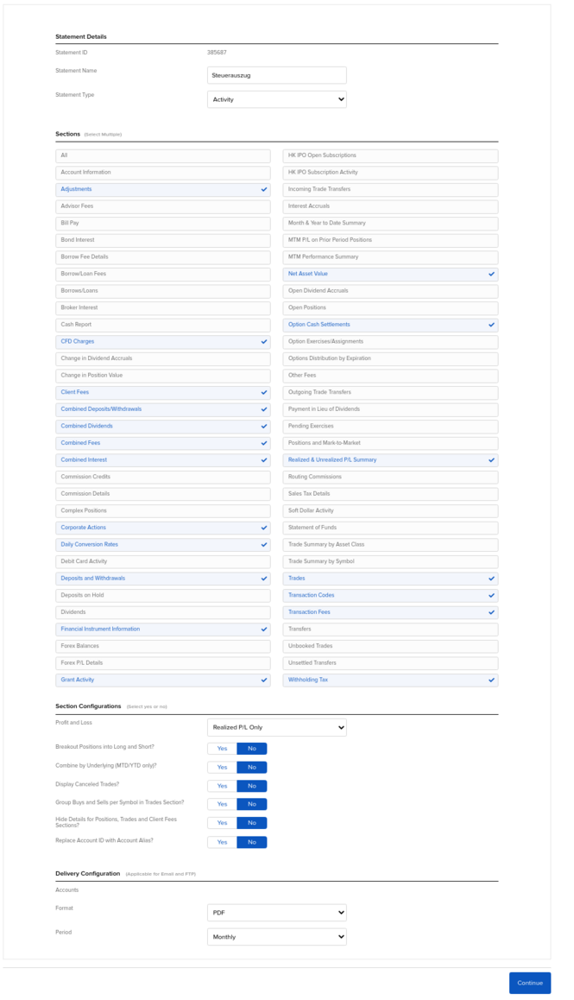

Steuern
=======

Linksammlung zu Steuern
-----------------------

- <https://www.finanztip.de/steuererklaerung-anlage-kap/>
- [Allianz Global Investors: Steuern für Privat- und Firmenanleger](https://de.allianzgi.com/de-de/service/steuern)
- <https://www.smartsteuer.de/online/lexikon/e/einkuenfte-aus-kapitalvermoegen/>
- <https://www.wallstreet-online.de/forum/85-1-50/recht-steuern>
- <https://www.wertpapier-forum.de/forum/101-steuern-recht-und-unternehmensgr%C3%BCndung/>
- <https://www.juhn.com/>
   - [YouTube Juhn](https://www.youtube.com/channel/UCRXSpcj8K_LKN4eVaXFJkmg)
- Besteuerung von Kryptowährungen: <https://pekuna.de/>
   - [YouTube Pekuna GmbH](https://www.youtube.com/channel/UCWSZXSjW59Tjnq7pjfMk69w)
- [Steuerberatergebührenverordnung](https://www.gesetze-im-internet.de/stbgebv/)
- Thomas Breiden - Kapitalerträge und Verlustverrechnung 31.01.2022: <https://www.youtube.com/watch?v=EZ99Pbi1osQ>
- <https://www.steuer-webinar.de/> von Daniel Denker
   - [YouTube Steuer-Webinar von Daniel Denker](https://www.youtube.com/c/SteuerWebinar/videos)
- Wenn man Unterlagen online anstelle von Ausdrucken dem Finanzamt übermitteln will,
  kann man dies in Baden-Württemberg über folgenden Link machen:
  <https://finanzamt-bw.fv-bwl.de/,Lde/Startseite/Service/Kontaktformular>
  Über WISO/Elster gibt es wohl auch eine Möglichkeit zur Übermittlung von Unterlagen.

Steuern bei inländischen Banken/Brokern
---------------------------------------

- [Deutsche Bank Steuermerkblatt](https://www.deutsche-bank.de/dam/deutschebank/de/shared/pdf/Steuermerkblatt-Inland.pdf)
- Über eine [Nichtveranlagungsbescheinigung](https://de.wikipedia.org/wiki/Nichtveranlagungsbescheinigung) werden keine Kapitelerträge besteuert.
- Eine [Günstigerprüfung](https://de.wikipedia.org/wiki/G%C3%BCnstigerpr%C3%BCfung) kann bei der Steuerabgabe
  gestellt werden, wenn der persönliche Steuersatz unter der Kapitalertragsteuer liegt.
- Wenn man Verluste über verschiedene Depots vom Finanzamt verrechnet haben will, muss man eine
  [Verlustbescheinigung](https://de.wikipedia.org/wiki/Verlustbescheinigung) anfordern.
  Ansonsten bleiben die Verluste bei den Brokern und werden nur dort für das nächste Jahr fortgeschrieben.

Steuern bei ausländischen Banken/Brokern
----------------------------------------

- Ausländische Broker behalten nur die Quellensteuer sofort ein.
- Alle anderen Steuern müsse mit der jährlichen Steuererklärung angegeben werden.
- <https://www.freakyfinance.net/>
   - <https://www.youtube.com/channel/UCmVWGQd6pf2vY1ZGScvyxvg/videos>
   - <https://www.youtube.com/watch?v=ZD9q78Jf3s8&t=497s>
- <https://www.youtube.com/watch?v=_crnNjefKOk>
- <https://www.youtube.com/watch?v=QFgyPz5Y7VA&t=451s>
- <https://www.youtube.com/watch?app=desktop&v=um7PTNidkpE>
- <https://www.haufe.de/finance/haufe-finance-office-premium/einkuenfte-aus-kapitalvermoegen-1225-zeilen-1826_idesk_PI20354_HI9285903.html>
- Mit dem Steuerbescheid kann das Finanzamt [Wikipedia: Steuervorauszahlungen](https://de.wikipedia.org/wiki/Steuervorauszahlung) festsetzen,
  die Quartalsweise an das Finanzamt zu zahlen sind. Man kann gegen diese Festsetzung beim Finanzamt
  Einspruch erheben (weil die Ergebnisse in Zukunft nicht zu erwarten sind) oder man kann später einen
  Antrag auf Herabsetzung der Vorauszahlungen stellen, wenn die aktuellen Ergebnisse niedriger ausfallen.

Regeln der Kapitalertragsteuer
------------------------------

- Siehe [Wikipedia: Einkünfte aus Kapitalvermögen](https://de.wikipedia.org/wiki/Eink%C3%BCnfte_aus_Kapitalverm%C3%B6gen_(Deutschland)),
- [Wikipedia:Kapitalertragsteuer](https://de.wikipedia.org/wiki/Kapitalertragsteuer_(Deutschland)) und
  [Wikipedia:Abgeltungsteuer](https://de.wikipedia.org/wiki/Abgeltungsteuer).
- Abgeltungssteuer ist 25 %. Darauf muss nochmal 5.5 % Solidaritätszuschlag (SolZ) (insgesamt 26,375 %) und für
  evangelische 8 % (insgesamt 27,8186 %) bzw. für katholische 9 % (insgesamt 27,9951 %) Kirchensteuer
  bezahlt werden.
- Eine [Günstigerprüfung](https://de.wikipedia.org/wiki/G%C3%BCnstigerpr%C3%BCfung) kann bei der Steuerabgabe
  gestellt werden, wenn der persönliche Steuersatz unter der Kapitalertragsteuer liegt.
- Mit dem [Sparerpauschbetrag](https://de.wikipedia.org/wiki/Sparer-Pauschbetrag) (Freibetrag) kassieren
  Singles Kapitalerträge bis 801 Euro und gemeinsam Veranlagte bis zu 1.602 Euro steuerfrei.
  Ab 2022 erhöht sich der Sparerpauschbetrag auf 1.200 Euro (2.400 Euro für Paare).
- Transaktionskosten werden direkt beim Kauf/Verkauf eingerechnet (und sind voll abzugsfähig).
- Sonstige Bank- und Depotverwaltungsgebühren sind bereits mit der Werbungskostenpauschale abgegolten.
  Auch alle Weiterbildungen, Seminare, Bücher, Computer- und Internetausgaben.
- Alle Kauf- und Verkaufspreise müssen in Euro umgerechnet werden.
- Beim Berechnen der Gewinne und Verluste wird die FIFO-Methode angewendet. (Nicht bei Stillhaltergeschäften.)
- Aktien
   - Aktienverluste dürfen nur mit Aktiengewinnen verrechnet werden. (Eigener Verlustverrechnungstopf.)
   - Bei Aktien-Leerverkäufen (über eine Jahresgrenze hinaus) wird 30 % vom Preis mit der KapESt
     als Ersatzbemessungsgrundlage besteuert (§ 43a Absatz 2 Satz 7 EStG) und erst mit der Eindeckung ausgeglichen.
   - Altbestände vor 2009.
- Dividenden und Quellensteuer
   - steuerfreie Dividenden, diese reduzieren den Anschaffungspreis: Vonovia, Deutsche Telekom, Freenet
   - [BMF-Schreiben zur Quellensteuer auf chinesische Aktien](https://www.bundesfinanzministerium.de/Content/DE/Downloads/BMF_Schreiben/Steuerarten/Abgeltungsteuer/20220331-anrechnung-von-quellensteuer-die-auf-ausschuettungen-von-chinesischen-aktien-erhoben-wird-auf-die-deutsche-kapitalertragsteuer.pdf?__blob=publicationFile&v=3)
- [Investmentsteuergesetz](https://de.wikipedia.org/wiki/Investmentsteuergesetz_(Deutschland))
   - Die Anlage KAP-INV muss dazu ausgefüllt werden.
   - <https://www.youtube.com/watch?v=mmQkGhfgD6w>
- Zinsen
   - Zinsen für Kredite sind nur abzugsfähig wenn damit höhere Gewinne erzielt werden.
- Optionen
   - Jede Option wird einzeln abgerechnet, es gibt keine gemeinsame Berechnung für komplexe Optionsstrategien.
   - Bei Stillhaltergeschäften wird die eingenommene Prämie sofort besteuert. (Short Call und Short Put.) (§ 20 Abs. 1 Nr. 11 EStG)
      - Wird bei Stillhaltergeschäften am Ende ein [Barausgleich](https://de.wikipedia.org/wiki/Barausgleich) ("cash settlement")
        gezahlt (meistens bei Indexoptionen), so ist dieser Barausgleich ein Termingeschäft.
      - Für die Einkünfte aus Stillhalterprämien müssen die Glattstellungskosten im Jahr des Zuflusses der Stillhalterprämien
        berücksichtigt werden und nicht in dem Zeitpunkt, in dem sie aufgewendet wurden:
        <https://www.bundesfinanzhof.de/de/entscheidung/entscheidungen-online/detail/STRE202210176/>
   - Bei Long-Optionen wird wie bei Aktien beim Verkauf der Gewinn/Verlust nach FIFO berechnet. (§ 20 Abs. 2 Satz 1 Nr. 3a EStG.)
     Diese gelten als Termingeschäfte und fallen unter die Verlustverrechnungsgrenze von 20.000 Euro pro Jahr.
   - Wird eine Long-Option angedient, wird der Kaufpreis der Option zum Anschaffungspreis vom Underlying hinzugerechnet.
- Optionsscheine, CFDs, Crypto, physisches Gold/Silber
   - hier nicht weiter betrachtet
   - <https://www.gold.de/steuern-edelmetalle/>
   - Besteuerung von Kryptowährungen: <https://pekuna.de/>
- Alle Verluste mit Termingeschäften dürfen pro Jahr und pro Person nur bis zu 20.000 Euro angerechnet werden (§ 20 Abs. 6 Satz 5 EStG),
  der Rest wird vorgetragen. (Verlustverrechnungsbeschränkung von Termingeschäften. Termingeschäfte sind u.a. Futures,
  Long-Optionen, CFDs.)
   - Verluste bei Termingeschäften bilden einen eigenen Verlustverrechnungstopf, nur Gewinne aus Stillhaltergeschäften
     dürfen damit verrechnet werden.
- Verbot von Futures ab 2023: <https://www.finanzen.net/nachricht/aktien/allgemeinverfuegung-bafin-einschraenkung-des-futures-handel-fuer-kleinanleger-ab-2023-11758139>
- Wertlose Wirtschaftsgüter dürfen nur iHv 20.000 Euro mit anderen Kapitalerträgen verrechnet werden.
- Sonstige Verluste aus Kapitalerträgen dürfen mit allen weiteren Gewinnen aus Kapitalerträgen verrechnet werden
  oder Vortrag in die Folgejahre.

Wie wird die KAP berechnet?
---------------------------

- Aktiengewinne minus Aktienverluste minus Aktienverlustvortrag (mindestens Null, ein Verlust wird nur vorgetragen)
- \+ Sonstige Gewinne
- \- Sonstige Verluste
- \- Sonstiger Verlustvortrag
- = Kapitalerträge (mindestens Null, ein Verlust wird nur vorgetragen)
- \- Sparer-Pauschbetrag
- = steuerpflichtige Kapitalerträge
- Davon 25 % (bzw. weniger bei erfolgreicher Günstigerprüfung) minus anrechenbare Quellensteuern ergibt die zu zahlenden Steuern,
  Soli und ggf. Kirche letztendlich darauf.

Eintragung Steuern 2021 {#KAP2021}
-----------------------

Z19 steht als Abkürzung für Zeile 19 im (durchnummerierten) Formular vom Finanzamt.

In Verlustzeilen werden die Verluste als positive Zahl eingetragen. (Z.B. bei der KAP2021 in Z23, Z24 und Z25.)

[KAP 2021](https://www.formulare-bfinv.de/ffw/catalog/makePDF.do?path=catalog://Steuerformulare/est/est21/034024_21):

- Zeile 18: Inländische Kapitalerträge
- Zeile 19: Ausländische Kapitalerträge
   - Zeile 20: In den Zeilen 18 und 19 enthaltene Gewinne aus Aktienveräußerungen
   - Zeile 21: In den Zeilen 18 und 19 enthaltene Einkünfte aus Stillhalterprämien und Gewinne aus Termingeschäften
   - Zeile 22: In den Zeilen 18 und 19 enthaltene Verluste ohne Verluste aus der Veräußerung von Aktien
   - Zeile 23: In den Zeilen 18 und 19 enthaltene Verluste aus der Veräußerung von Aktien
- Zeile 24: Verluste aus Termingeschäften
- Zeile 25: Verluste aus der ganzen oder teilweisen Uneinbringlichkeit einer Kapitalforderung,
  Ausbuchung, Übertragung wertlos gewordener Wirtschaftsgüter oder aus einem sonstigen Ausfall von Wirtschaftsgütern
- Zeile 41: Anrechenbare noch nicht angerechnete ausländischen Steuern (gezahlte Quellensteuer)

| KAP 2021                    | Z19 | Z20 | Z21 | Z22 | Z23 | Z24 | Z25 | Z41 |
|-----------------------------|-----|-----|-----|-----|-----|-----|-----|-----|
| Aktiengewinne               | x   | x   |     |     |     |     |     |     |
| Aktienverluste              | x   |     |     |     | x   |     |     |     |
| Aktien Totalverlust         |     |     |     |     |     |     | x   |     |
| Stillhaltergewinne          | x   |     | x   |     |     |     |     |     |
| Stillhalterverluste         | x   |     | x   | x   |     |     |     |     |
| Long-Optionen-Gewinne       | x   |     | x   |     |     |     |     |     |
| Long-Optionen-Verluste      |     |     |     |     |     | x   |     |     |
| Long-Optionen Totalverluste |     |     |     |     |     |     | x   |     |
| Futuregewinne               | x   |     | x   |     |     |     |     |     |
| Futureverluste              |     |     |     |     |     | x   |     |     |
| CFD-Gewinne                 | x   |     | x   |     |     |     |     |     |
| CFD-Verluste                |     |     |     |     |     | x   |     |     |
| Dividenden                  | x   |     |     |     |     |     |     |     |
| Zinsen                      | x   |     |     |     |     |     |     |     |
| Quellensteuer               |     |     |     |     |     |     |     | x   |

Offene Fragen:

- Nach Gesetzestexten könnte man Long-Optionen-Verluste auch in Z25 eintragen und damit die
  Verlustbeschränkungen auf mehrere Töpfe verteilen. Dies ist im neusten BMF-Schreiben allerdings
  nicht erwähnt.
- Zeile 21 erlaubt im digitalen Formular keine negativen Einträge, nur positive. Durch Stillhalterverluste kann
  ein negativer Wert herauskommen.
- (Bereits oben richtig eingetragen:) Verluste aus Termingeschäften (bei ausl. Broker) werden separiert
  und nur in Zeile 24 eingetragen.  (Auch nicht in Zeile 18/19 und auch nicht in Zeile 22.)
   - Auch Zeile 25 ist nicht in Zeile 18/19 enthalten.
- (Manche Steuersoftware geht nicht korrekt damit um, wenn man Aktiengewinne und Aktienverluste eintragen will.)
- Die deutschen Dividenden gehören in Zeile 7, die dazu gehörigen Steuern in Zeile 37 und 38.
   - Die deutschen Dividenden gehören in Zeile 7 "Kapitalerträge, die dem inländischen Steuerabzug unterlegen haben".
     Die Quellensteuer sollte ziemlich genau 26,375 % betragen und gehört aufgeteilt (25 % KapErSt und 1,375% Soli = 5,5 % aus 25 %)
     in die Zeilen 37 und 38. Bei Land = DE sind das keine QSt im Sinne von Zeile 40 "anrechenbare QSt" der Anlage KAP.

KAP-INV 2021:

Anlage SO 2021:

- Zeile 44: Veräußerungspreis oder an dessen Stelle tretender Wert
   - Währungsgewinne / Devisengewinne

aktuelle Rechtsprechung, BMF und Zusatzinfos
--------------------------------------------

- [alle BMF-Schreiben](https://www.bundesfinanzministerium.de/Web/DE/Service/Publikationen/BMF_Schreiben/bmf_schreiben.html)
- <https://www.bundesfinanzministerium.de/Content/DE/Downloads/BMF_Schreiben/Steuerarten/Abgeltungsteuer/2020-11-11-KapitalertragSt-Ausstellung-Steuerbescheinigung-Kapitalertraege.pdf?__blob=publicationFile&v=2>
- BMF zur Abgeltungssteuer
   - [BMF Einzelfragen zur Abgeltungsteuer 2016-01-18](https://www.bzst.de/SharedDocs/BMF/DE/Downloads/bmf_Schreiben_20160118_Einzelfragen_Abgeltungsteuer.html)
   - [BMF Einzelfragen zur Abgeltungsteuer 2021-02-19](https://www.bundesfinanzministerium.de/Content/DE/Downloads/BMF_Schreiben/Steuerarten/Abgeltungsteuer/2021-02-19-einzelfragen-zur-abgeltungsteuer.pdf?__blob=publicationFile&v=1)
   - [BMF Einzelfragen zur Abgeltungsteuer 2021-06-03](https://www.bundesfinanzministerium.de/Content/DE/Downloads/BMF_Schreiben/Steuerarten/Abgeltungsteuer/2021-06-03-einzelfragen-zur-abgeltungsteuer-ergaenzung-des-BMF-Schreibens-vom-18-Januar-2016.pdf?__blob=publicationFile&v=1)
      - <https://www.youtube.com/watch?v=xZyWEzCsF9A>
   - [BMF Einzelfragen zur Abgeltungsteuer 2022-05-19](https://www.bundesfinanzministerium.de/Content/DE/Downloads/BMF_Schreiben/Steuerarten/Abgeltungsteuer/2022-05-19-einzelfragen-zur-abgeltungsteuer.pdf?__blob=publicationFile&v=2)
- BMF zum Investmentsteuergesetz 2018 (InvStG 2018)
   - Vorabpauschale 2018: Basiszins ist 0,87 %
   - Vorabpauschale 2019: Basiszins ist 0,52 %
   - [Vorabpauschale 2020](https://www.bundesfinanzministerium.de/Content/DE/Downloads/BMF_Schreiben/Steuerarten/Investmentsteuer/2020-01-29-basiszins-zur-berechnung-der-vorabpauschale.pdf?__blob=publicationFile&v=4): Basiszins ist 0,07 %
   - [Vorabpauschale 2021](https://www.bundesfinanzministerium.de/Content/DE/Downloads/BMF_Schreiben/Steuerarten/Investmentsteuer/2021-01-06-basiszins-zur-berechnung-der-vorabpauschale.pdf?__blob=publicationFile&v=3): Basiszins ist -0,45 %, es wird keine Vorabpauschale erhoben
   - [Vorabpauschale 2022](https://www.bundesfinanzministerium.de/Content/DE/Downloads/BMF_Schreiben/Steuerarten/Investmentsteuer/2022-01-07-basiszins-zum-3-januar-2022-zur-berechnung-der-vorabpauschale-gemaess-paragraf-18-absatz-4-InvStG.pdf?__blob=publicationFile&v=2): Basiszins ist -0,05 %, es wird keine Vorabpauschale erhoben
   - [Anwendungsfragen vom 2017-09-21](https://www.bundesfinanzministerium.de/Content/DE/Downloads/BMF_Schreiben/Steuerarten/Investmentsteuer/2017-09-21-anwendungsfragen-zum-investmentsteuergesetz-in-der-am-1-Januar-2018-geltenden-fassung-InvStG-2018.pdf?__blob=publicationFile&v=4)
   - [Anwendungsfragen vom 2017-11-08](https://www.bundesfinanzministerium.de/Content/DE/Downloads/BMF_Schreiben/Steuerarten/Investmentsteuer/2017-11-08-anwendungsfragen-zum-investmentsteuergesetz-in-der-am-1-januar-2018-geltenden-fassung-InvStG-2018-dringliche-fragen-der-DK-sowie-des-BVI.pdf?__blob=publicationFile&v=4)
   - [Anwendungsfragen vom 2017-12-21](https://www.bundesfinanzministerium.de/Content/DE/Downloads/BMF_Schreiben/Steuerarten/Investmentsteuer/2017-12-21-Anwendungsfragen-Investmentsteuergesetz-Dringliche-Fragen-BVI-DK.pdf?__blob=publicationFile&v=4)
   - [Fristverlaengerung vom 2018-04-09](https://www.bundesfinanzministerium.de/Content/DE/Downloads/BMF_Schreiben/Steuerarten/Investmentsteuer/2018-04-09-Fristverlaengerung-Veroeffentlichung-Besteuerungsgrundlagen-Investmentfonds.pdf?__blob=publicationFile&v=4)
   - [Anwendungsfragen vom 2018-05-15](https://www.bundesfinanzministerium.de/Content/DE/Downloads/BMF_Schreiben/Steuerarten/Investmentsteuer/2018-05-15-Anwendungsfragen-InvStG-2018.pdf?__blob=publicationFile&v=4)
   - [Anwendungsfragen vom 2018-08-29](https://www.bundesfinanzministerium.de/Content/DE/Downloads/BMF_Schreiben/Steuerarten/Investmentsteuer/2018-08-29-Anwendungsfragen-InvStG-2018-Auslegungsfragen-Par-35-u-48.pdf?__blob=publicationFile&v=4)
   - [Anwendungsfragen vom 2019-05-21](https://www.bundesfinanzministerium.de/Content/DE/Downloads/BMF_Schreiben/Steuerarten/Investmentsteuer/2019-05-21-anwendungsfragen-zum-investmentsteuergesetz-in-der-am-1-januar-2018-geltenden-fassung-InvStG-2018.pdf?__blob=publicationFile&v=4)
   - [Muster-Investmentanteil-Bestandsnachweis](https://www.bundesfinanzministerium.de/Content/DE/Downloads/BMF_Schreiben/Steuerarten/Investmentsteuer/2019-08-07-Muster-Investmentanteil-Bestandsnachweis.pdf?__blob=publicationFile&v=4)
   - [Anwendungsfragen vom 2020-07-28](https://www.bundesfinanzministerium.de/Content/DE/Downloads/BMF_Schreiben/Steuerarten/Investmentsteuer/2020-07-28-anwendungsfragen-zum-InvStG-in-der-ab-1-januar-2018-geltenden-fassung.pdf?__blob=publicationFile&v=2)
   - [Anwendungsfragen vom 2020-10-29](https://www.bundesfinanzministerium.de/Content/DE/Downloads/BMF_Schreiben/Steuerarten/Investmentsteuer/2020-10-29-anwendungsschreibens-zum-investmentsteuergesetz.pdf?__blob=publicationFile&v=1)
   - [Anwendungsfragen vom 2021-01-20](https://www.bundesfinanzministerium.de/Content/DE/Downloads/BMF_Schreiben/Steuerarten/Investmentsteuer/2021-01-20-anwendungsschreibens-zum-investmentsteuergesetz.pdf?__blob=publicationFile&v=2)
   - [Anwendungsfragen vom 2021-04-29](https://www.bundesfinanzministerium.de/Content/DE/Downloads/BMF_Schreiben/Steuerarten/Investmentsteuer/2021-04-29-anwendungsfragen-zum-InvStG-in-der-ab-1-januar-2018-geltenden-fassung.pdf?__blob=publicationFile&v=3)
   - [Anwendungsfragen vom 2021-06-01](https://www.bundesfinanzministerium.de/Content/DE/Downloads/BMF_Schreiben/Steuerarten/Investmentsteuer/2021-06-01-anwendungsschreiben-zum-InvStG-in-der-ab-1-Januar-2018-geltenden-fassung.pdf?__blob=publicationFile&v=1)
   - [Anwendungsfragen vom 2021-06-18](https://www.bundesfinanzministerium.de/Content/DE/Downloads/BMF_Schreiben/Steuerarten/Investmentsteuer/2021-06-18-anwendungsschreiben-zum-investmentsteuergesetz-in-der-am-1-Januar-2018-geltenden-fassung.pdf?__blob=publicationFile&v=1)
   - [Anwendungsfragen vom 2021-08-18](https://www.bundesfinanzministerium.de/Content/DE/Downloads/BMF_Schreiben/Steuerarten/Investmentsteuer/2021-08-18-anwendungsfragen-zum-investmentsteuergesetz-in-der-am-1-januar-2018-geltenden-fassung.pdf?__blob=publicationFile&v=2)
   - [Anwendungsfragen vom 2022-03-15](https://www.bundesfinanzministerium.de/Content/DE/Downloads/BMF_Schreiben/Steuerarten/Investmentsteuer/2022-03-15-anwendungsfragen-zum-investmentsteuergesetz-in-der-am-1-januar-2018-geltenden-fassung-InvStG-2018.pdf?__blob=publicationFile&v=3)
- [BMF: Stand DBA 2021](https://www.bundesfinanzministerium.de/Content/DE/Downloads/BMF_Schreiben/Internationales_Steuerrecht/Allgemeine_Informationen/2021-02-18-stand-DBA-1-januar-2021.pdf?__blob=publicationFile&v=3)
- [BMF: Stand DBA 2022](https://www.bundesfinanzministerium.de/Content/DE/Downloads/BMF_Schreiben/Internationales_Steuerrecht/Allgemeine_Informationen/2022-01-19-stand-DBA-1-januar-2022.pdf?__blob=publicationFile&v=3)
- [BMF-Schreiben zu virtuellen Währungen und Token](https://www.bundesfinanzministerium.de/Content/DE/Downloads/BMF_Schreiben/Steuerarten/Einkommensteuer/2021-06-17-est-kryptowaehrungen.pdf?__blob=publicationFile&v=2)
- [Bundesfinanzhof: anhänige Verfahren](https://www.bundesfinanzhof.de/de/anhaengige-verfahren/entscheidungsvorschau/)

Aktienverluste voll anrechnen
-----------------------------

- [Aktienverluste: BFH hält Verrechnungsbeschränkung für verfassungswidrig](https://www.boerse-online.de/nachrichten/geld-und-vorsorge/aktienverluste-bfh-haelt-verrechnungsbeschraenkung-fuer-verfassungswidrig-1030494333)
   - <https://blog.handelsblatt.com/steuerboard/2021/06/07/gute-nachrichten-fuer-private-anleger-bfh-haelt-beschraenkung-der-verlustverrechnung-fuer-aktien-fuer-verfassungswidrig/>
   - [Steuer-Webinar: BFH hält Regelung im Einkommensteuergesetz für verfassungswidrig](https://www.youtube.com/watch?v=Bhkqy7_hn80)

Doppelbsteuerung der Renten
---------------------------

- <https://www.youtube.com/watch?v=OJpHKpwpZm8>
- <https://www.youtube.com/watch?v=pVpOfza6Sqs>

Termingeschäftsverluste ab 2021
-------------------------------

- <https://epetitionen.bundestag.de/content/petitionen/_2021/_06/_06/Petition_124097.html>
- <https://www.openpetition.de/petition/online/initiative-ruecknahme-der-steuerlichen-benachteiligungen-privater-anleger>
- <https://www.youtube.com/c/MartinHlouschekOptionstrader/videos>

Steuern bei Fremdwährungskonten {#fremdwaehrungskonten}
-------------------------------

Links:

- <https://www.steuernetz.de/lexikon/private-veraeusserungsgeschaefte>
- <https://www.wertpapier-forum.de/topic/45232-steuerliche-behandlung-fremdw%C3%A4hrungskonto-ib-oder-andere-broker/>
- <https://www.wertpapier-forum.de/topic/53676-versteuerung-bei-ausl-aktien-mit-w%C3%A4hrungstausch/>
- <https://www.wertpapier-forum.de/topic/56107-interactive-brokers-steuererkl%C3%A4rung-fifo-berechnung-devisen/>
- <https://www.youtube.com/watch?v=VRjp1yVvHcg>   ab Minute 39
- <https://www.youtube.com/watch?v=Bm2r2yXCJ30>
   - <https://fintax-steuerberater.de/>
   - <https://fintegra.de/steuerliches-fremdwaehrungsreporting/>
- <http://www.iusconsulting.de/de/portal-eintrag/private-veraumluszligerungsgeschaumlfte>

Zusammenfassung Steuern im Privatvermögen bei Fremdwährungskonten:

- Private Veräußerungsgeschäfte werden in [§ 23 EStG](https://www.gesetze-im-internet.de/estg/__23.html) behandelt. (EStG = Einkommensteuergesetz)
- Bei der Anschaffung und Veräußerung von Fremdwährungsbeträgen kann es sich um ein
  privates Veräußerungsgeschäft i.S. des [§ 23 Abs. 1 Nr. 2 EStG](https://www.gesetze-im-internet.de/estg/__23.html) handeln.
  Diese werden in der privaten Einkommensteuererklärung in der
  [Anlage SO](https://www.formulare-bfinv.de/ffw/catalog/openForm.do?path=catalog%3A%2F%2FBuerger%2Fsteuern%2Fest%2Fest20%2F034029_20)
  in Zeile 49 angegeben.
- Laut [BMF-Schreiben zur Abgeltungssteuer vom 2022-05-19](https://www.bundesfinanzministerium.de/Content/DE/Downloads/BMF_Schreiben/Steuerarten/Abgeltungsteuer/2022-05-19-einzelfragen-zur-abgeltungsteuer.pdf?__blob=publicationFile&v=2#page=58) können laut R131 die Währungsgewinne auch in der KAP versteuert werden (Ist das richtig?):
   Wird der Fremdwährungsbetrag innerhalb der Frist des § 23 Absatz 1 Satz 1 Nummer 2 EStG
   in Euro oder eine dritte Währung getauscht, so sind Währungsgewinne/-verluste die bereits
   bei den Einkünften aus Kapitalvermögen erfasst wurden, nicht zusätzlich bei den Einkünften
   aus privaten Veräußerungsgeschäften zu erfassen, § 23 Absatz 2 EStG.
- Da die Gewinne aus § 23 EStG nicht dem Steuerabzug unterliegen, ermitteln die inländischen
  Banken diese Gewinne in der Regel nicht. Die Einkünfte müssen daher eigenständig ermittelt
  werden und - sofern die Freigrenze des § 23 Abs. 3 Satz 5 EStG von 600 € überschritten ist - in der
  Einkommensteuererklärung (Anlage SO) erklärt werden. BMF, Schreiben v. 18.1.2016 - IV C 1 - S
  2252/08/1004:017, BStBl 2016 I S. 85 NWB WAAF-66193, Rz 131.
- Unterliegen nicht der Abgeltungssteuer sondern dem persönlichen Steuersatz.
- Fremdwährungen fallen nicht unter die Abgeltungssteuer/KapESt und werden daher von den Banken auch nicht
  in Ihrem Steuer-Reporting erfasst. Der Steuerpflichtige muss dies eigenverantwortlich übernehmen.
- Währungen gelten als Spekulationsgeschäfte, steuerbar beim Verkauf (betrachte das fremde Geld einfach als Wertpapiere)
   - Ein Konto in einer nicht-Euro-Währung gilt als eigenes Asset und muss besteuert werden.
- Für die Veräußerungsgewinnberechnung gilt die FiFo-Methode.
- die Spekulationsfrist beträgt ein Jahr (bei verzinster Anlage 10 Jahre), danach ist es immer steuerfrei
   - die 10 Jahre werden imho im Normalfall nicht angewandt, diese Regel ist nur für gezielte Steuervermeidungsstrategien (etwa spezielle Fonds)
   - Zur 10-Jahresverlängerung: Meines Wissens (Hinweis meiner Bank) gibt es vom BayLfSt die Verfügung vom 10.3.2016 die darlegt,
     dass die Erhöhung der Spekulationsfrist auf 10 Jahre (bei Festgeldverzinsung) nicht greift.
     <https://www.haufe.de/steuern/finanzverwaltung/veraeusserungsgewinne-bei-fremdwaehrungsgeschaeften-im-fokus_164_373742.html>
   - <https://www.wertpapier-forum.de/topic/53676-versteuerung-bei-ausl-aktien-mit-w%C3%A4hrungstausch/?do=findComment&comment=1354931>:
     Ein Nebeneffekt ist, dass verzinsliche Währungsguthaben dennoch nur der Ein-Jahresfrist in § 23 EStG unterliegen (und nicht verlängert),
     weil die Zinsen ja nicht für das Wirtschaftsgut "Währungsguthaben", sondern für die darunter liegende Forderung an sich bezahlt werden.
     Zinsen fallen unter § 20 EStG.
   - Bei der Berechnung der Spekulationsfrist wird der Tag der Anschaffung nicht mitgerechnet.
- Freigrenze 600 Euro (für alle Spekulationsgewinne zusammen), darunter immer steuerfrei
- Verluste werden in einem extra Verlustverrechnungstopf vom Finanzamt vorgetragen und können (auf Antrag) nur mit Gewinnen aus dem Vorjahr
  verrechnet werden.
- Dividendenauszahlungen/Optionsprämien/Zinsen in Fremdwährung sind keine "Anschaffung" von Währungsguthaben
  im Sinne von § 23 EStG (da gilt eine enge Auslegung des Anschaffungsbegriffs), sondern ein Zufluss (Der Zufluss an sich fällt ja unter § 20 EStG als Kapitalertrag).
  Die spätere Veräußerung von Währungsguthaben aus Dividendenzuflüssen ist somit nie nach § 23 EStG steuerbar, weil es kein Anschaffungsgeschäft dazu gibt.
  Anschaffung = Erwerb von etwas Bestehendem von einem Dritten gegen Hingabe des Kaufpreises.
- Abflüsse, die keine Veräußerung darstellen. Ich zähle dazu u.a. Kontogebühren, fremde Steuern, Zinsen etc. im Zusammenhang mit der Kapitalüberlassung

Steuern für Accounts bei Interactive Brokers
--------------------------------------------

Von einem Jahresreport lässt sich weitgehend (etwas pauschalisiert) die Steuer erledigen.
Bei IB kann man sich aktuell die Daten der letzten 5 Jahre ausgeben lassen.

Bei den Zahlen ist der Report etwas ungenau bei der Berechnung der Gewinne nach FIFO. Anstatt
sowohl den Kauf wie den Verkauspreis in Euro umzurechnen wird hier der Gewinn in USD berechnet
und dann nur dieser USD-Gewinn einmal am Schluss in Euro umgerechnet.

Bei Stillhaltergeschäften wird beim Report von IB erst beim Schliessen der Position der Gewinn
ermittelt. Bis dahin gilt die Position als offen und nicht realisiert.
Nach offiziellen Regeln muss direkt beim Öffnen die Prämie versteuert werden und dann
die Glattstellungsprämie als Verlust gebucht werden. Dies macht vor allem bei Trades über
die Jahresgrenze einen Unterschied, da diese dann erst im Folgejahr bei den realisierten Gewinnen
auftauchen.

Es gibt Berichte, dass bei Andienung von Short Optionen die Prämien mit in die Aktienpreise
eingerechnet werden. (Hab ich nicht verifiziert, sollte ja eigentlich nur für Long-Optionen
gemacht werden.)
Damit werden Einnahmen zwischen verschiedenen Einnahmetöpfen verschoben.

Die Berechnung von Fremdwährungsgewinnen entspricht nicht den Steuer-Regeln. Viele lassen diese
Angaben wohl in der Steuererklärung komplett weg. (Eine Freigrenze gibt es dazu auch.)

Wenn man sich im IB Account einloggt, kann man unter "Berichte" und dann "Kontoauszüge" so
einen Jahresreport neu definieren. (Bei englischer Sprache ist das unter "Reports" und dann
"Statements" zu finden.) Folgende Einstellungen sollten ganz gut geeignet sein:

Für die eigenen Unterlagen kann man ja noch einen kompletten Report mit allen Daten erstellen.

Für Zinsen behält IB Irland 20% an Quellensteuer ein, wenn man nicht einen Freistellungsantrag
über <https://ibkr.info/node/4687> erstellt.

Software zum Einlesen der Interactive Broker Reports
----------------------------------------------------

Hier eine Sammlung an freier Software, die mit dem Einlesen der Reports von
Interactive Brokers zu tun hat. Vielleicht bekommt man damit für eine
Steuererklärung weiter.

- Steuerdaten für Interactive Brokers erstellen: <https://github.com/tobigs/IB_Tax>
- <https://github.com/cdump/investments>
- <https://github.com/titov-vv/jal>
- <https://github.com/KonishchevDmitry/investments>
- <https://github.com/gabbersepp/ib-flex-reader>
   - aktiver Fork: <https://github.com/zdomokos/ib-flex-reader>
- <https://github.com/csingley/ibflex>
- <https://github.com/airens/interactive_brokers_tax>
- <https://github.com/wilsonfreitas/awesome-quant>
- <https://github.com/shashankvemuri/Finance>

